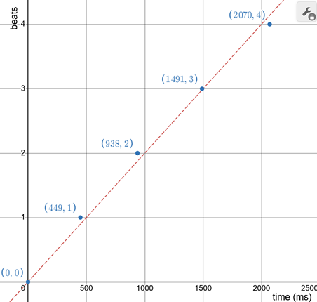

+++
title = "BPM Calculator"
date = "2025-03-22"
+++

[BPM Calculator](https://laclark.me/tools/bpm) |
[source on GitHub](https://github.com/lucdar/bpm)

# Usage

This website is a tool that gives a beats-per-minute estimation of the rate of
your inputs. For me, this is mainly relevant for music, but other applications
are possible (e.g. heart rate). I use tools like this when writing charts for
rhythm games or when I'm just curious about the speed of a song.

To use it, type a key on your keyboard or click (outside the box) to the beat of
whatever it is you are trying to measure. After two inputs, the UI will update
and give you estimations of the rate of your taps in beats per minute. Generally
speaking, more data will result in more accurate estimations. You can adjust the
reset timing by clicking the arrows.

# Algorithms

Since the inputs are from a human, there will naturally be some variation: some
will be a little early, and others a little late. I used three different
algorithms used for computing bpm estimations from these noisy measurements,
each with their own benefits and shortcomings. Before we get into it, let's
frame the problem a little more formally.

Inputs are collected as a list of timestamps; the first timestamp corresponds to
the first beat (and so on). When reasoning about this problem, it was helpful to
imagine plotting this data on a coordinate plane. Here's an example with some
simulated data (thank you desmos):



The x-axis corresponds to the time since the first measurement and the y-axis
corresponds to the number of beats before that measurement (i.e. its index in
the list of timestamps). The red dashed line is the "corect"

Recall that $ \text{slope} = \frac{\Delta y}{\Delta x} =
\frac{\text{rise}}{\text{run}} $. In our encoding, a change in y (a "rise")
corresponds to an increase in counted beats, and a change in x (a "run")
corresponds to a change in time. This means slope is a measure of $
\frac{\text{beats}}{\text{time}} $, or beats per minute! In other words, we want
to find a slope that's representative of the data.

## Direct

The most straightforward way of doing this is to measure the slope of the line
connecting the endpoints of our data. One issue with this method is that if the
start or end are especially noisy compared to the rest of the data, the
resulting BPM estimation could be very far from the correct value. Though, this
noise's effect diminishes as the number of samples increases.

The implementation of this algorithm is quite simple and runs in constant time.

```Rust
pub fn direct_count(offsets: &[u64]) -> f64 {
    // get the first and last values
    let start = offsets[0];
    let end = offsets.last().unwrap();
    // calculate the change in time
    let delta = end - start;
    // len - 1 is used so only one of start/end is counted
    let count = (offsets.len() - 1) as f64;
    count * 60_000_f64 / delta as f64
}
```

## Least-Squares Linear Regression

The direct approach above works reasonably well, but we're ignoring a lot of our
data. Instead of just fitting a line to first and last data point, we can find
the line that fits all of our data the best. The notion of fitting a function to
data is called regression, and there are many different approaches we could
take.

The underlying model of our data is a linear equation:

$$ y = mx + b $$

$ y $ (the number of beats) increases at a constant rate with respect to $ x $
(the time elapsed). $ m $ is this rate of increase (the slope) and is
proportional to the bpm. $ b $ is the y-intercept and accounts for the input
offset and any constant error, but it's not necessary for computing $ m $ which
is what we're after.

This model can "predict" what our number of beats should be, given a certain
timestamps. It'll probably be a little wrong, but we can quantify this error by
subtracting the actual measurement by the computed measurement and squaring it.

$$ (y_i - (mx_i + b))^2 $$

The line that minimizes this error across all of our data is the least-squares
regression line.

Why are we squaring the error? All the error values should be positive so when
we add them up across all our data points they accumulate instead of canceling
out. Technically, absolute value would also do this, but squaring the error
makes the math _much_ easier.



These calculations have been adapted from professor James Kirchner's
[Data Analysis Toolkit #10](https://seismo.berkeley.edu/~kirchner/eps_120/Toolkits/Toolkit_10.pdf).
These notes were critical in solidifying my understanding of least-squares (for
the scalar case).

We want to find a value of $ m $ that minimizes the cost function, $ Q $:

$$
    Q = \sum\limits_{i=0}^n{(y_i - (mx_i + b))^2}
$$

We can take the partial derivative of $ Q $ for both $ b $ and $ m $ and set it
to 0 to find the values that minimize $ Q $.

$$
\begin{aligned}
    \frac{\delta Q}{\delta b} = \sum\limits_{i=0}^n -2(y_i - b - mx_i) &= 0 \\\\
    2(nb + m\sum\limits_{i=0}^n x_i - \sum\limits_{i=0}^n y_i) &= 0 \\\\
    b + \frac{m}{n}\sum\limits_{i=0}^n x_i - \frac{1}{n}\sum\limits_{i=0}^n y_i &= 0 \\\\
    b + m\bar{x} - \bar{y} &= 0
\end{aligned}
$$

$$
b = \bar{y} - m\bar{x}
$$

This illustrates an interesting property of the line of least squares: it always
travels through the point $ (\bar{x}, \bar{y}) $, the mean of our data. Now,
let's take the partial derivative with respect to $ m $:

$$
\begin{aligned}
    \frac{\delta Q}{\delta b} = \sum\limits_{i=0}^n -2x_i(y_i - b - mx_i) &= 0 \\\\
    \sum\limits_{i=0}^n -2(y_ix_i - bx_i - mx_i^2) &= 0 \\\\
\end{aligned}
$$

Substituting the value for $ b $ from earlier:

$$
\begin{aligned}
    \sum\limits_{i=0}^n -2(y_ix_i - (\bar{y} - m\bar{x})x_i - mx_i^2) &= 0 \\\\
    -2 \sum\limits_{i=0}^n (y_ix_i - \bar{y}x_i + m(\bar{x}x_i - x_i^2)) &= 0 \\\\
    \sum\limits_{i=0}^n (y_ix_i - \bar{y}x_i) - m\sum\limits_{i=0}^n(x_i^2 - \bar{x}x_i) &= 0
\end{aligned}
$$

We can rewrite the above to solve for m:

$$
m = \frac
    {\sum\limits_{i=0}^n (y_ix_i - \bar{y}x_i)}
    {\sum\limits_{i=0}^n (x_i^2 - \bar{x}x_i)}
  = \frac
    {\sum\limits_{i=0}^n (y_ix_i) - \bar{y}\sum\limits_{i=0}^n x_i}
    {\sum\limits_{i=0}^n (x_i^2) - \bar{x}\sum\limits_{i=0}^n x_i}
  = \frac
    {\sum\limits_{i=0}^n x_i y_i - n\bar{x}\bar{y}}
    {\sum\limits_{i=0}^n x_i^2 - n\bar{x}^2}
$$



The result of the math above is the following equation:

$$
    m = \frac
    {\sum\limits_{i=0}^n{x_i y_i} - n\bar{x}\bar{y}}
    {\sum\limits_{i=0}^n{x_i^2} - n\bar{x}^2}
$$

And here's the implementation of this formula in Rust:

```Rust
pub fn simple_regression(offsets: &[u64]) -> f64 {
    let (sum_x, sum_x_squared, sum_xy) = offsets
        .iter()
        .enumerate()
        .fold((0_u64, 0_u64, 0_u64), |(sx, sxx, sxy), (y, x)| {
            (sx + x, sxx + x * x, sxy + (y as u64) * x)
        });

    let n = offsets.len() as f64;
    let mean_x = sum_x as f64 / n;
    let mean_y = (n - 1_f64) / 2_f64;

    let slope = // beats per millisecond
        (sum_xy as f64 - n * mean_x * mean_y) /
        (sum_x_squared as f64 - n * mean_x * mean_x);

    slope * 60_000_f64
}
```

Since the data points are processed one-by-one, one could implement this as a
streaming algorithm where we store and update `sum_x`, `sum_x_squared` and
`sum_xy` as each timestamp comes in. This is more efficient because we don't
have to loop through all of our timestamps every time a new one is added.
However, since the performance of the $ O(n) $ algorithm wasn't an issue for the
usability of the website, I decided this would be a preemptive optimization.

In general I find this algorithm to converge to the "true" bpm faster than the
direct approach. Instead of waiting for the noise in the initial sample to be
rounded off by a large enough delta-t, the guess is improved with every new
point that we add!

## Thiel-Sen Estimator

When doing research on Linear regression, I learned about the Thiel-Sen
estimator. It's similar to the first approach where we draw a line between two
of our samples and measure its slope. However, instead of just looking at the
two endpoints, we consider _every_ pair of points in our dataset.

From the set of lines that connect each pair, you can take the _median_ slope
and y-intercept to form a linear equation. This estimator fits the data quite
well, and is very resistant to outliers!

This algorithm's strengths come from using the median as the mechanism for
representing the data. Compared to the mean (the "average"), the median (the
middle value when sorted) isn't affected as much by an extreme value. For the
purposes of the website, if you accidentally tap too early or late but keep the
correct number of beats, the Thiel-Sen estimator will be more accurate than the
simple linear regression.

Here's the implementation in Rust:

```Rust
pub fn thiel_sen(offsets: &[u64]) -> Result<f64, BpmCalculationError> {
    let mut slopes: Vec<_> = offsets
        .iter()
        .enumerate()
        .tuple_combinations()
        // indices (number of beats) are the y-values
        .map(|((y1, x1), (y2, x2))| (y2 - y1) as f64 / (x2 - x1) as f64)
        .collect();
    let mid = slopes.len() / 2;
    let (_left, median, _right) = slopes.select_nth_unstable_by(mid, |a, b| a.total_cmp(b));

    Ok(*median * 60_000_f64)
}
```

Shout out to [itertools](https://crates.io/crates/itertools) for
[tuple_combinations](https://docs.rs/itertools/latest/itertools/trait.Itertools.html#method.tuple_combinations)
(the hard part).

The number of possible pairs of points grows quite quickly (caused by the call
to tuple_combinations) so this algorithm runs in $ O(n^2) $ time. Like the
simple linear regression case, this too is avoidable. You can randomly sample
from the pairs of points (which works quite well!) or use a more complicated
algorithm that runs in $ O (n \log n) $ time. Once again, since the website ran
smoothly without these optimizations I figured it would be hasty for me to "fix"
something that already works.

# Design

When writing the basic functionality of the site I was a little torn on how I
wanted it to look. I kept things simple (no CSS) while I worked on building out
the functionality, and then I spent an afternoon deciding on a visual
style/direction. I felt inspired by my terminal, and thought that monospace was
an aesthetic I wanted to see in tools for non-developers (like this one). I
opened Microsoft Notepad and started experimenting with the layout.

While adding descriptions to the end of each BPM prediction two of them happened
to be the same line length. This coincidence always brings me a very specific
kind of satisfaction, but I also remembered that it didn't have to be a
coincidence.

A few years ago, I saw someone post this guide
[this guide](https://gamefaqs.gamespot.com/snes/588741-super-metroid/faqs/10114)
to speedrunning Super Metroid by rs1n. At first glance it seems pretty normal,
but if you look closely, you'll realize that the words and punctuation were
carefully chosen so that each line is exactly the same length.

I decided that I would follow in rs1n's footsteps (the first few, at the very
least) and force each of the labels to be the same length. This way, they would
provide a straight right edge and give the interface a more structured feeling.
I had to compromise on semantics and clarity, but I think the end result looks
pretty cool!

Given enough time and flexibility with the exact idea that you want to convey, I
think it's generally possible to re-word most passages to be fully-justified
monospace. The English language is surprisingly capable when it comes to this
specific task, and I think it was a pretty fun exercise. You should try it out
sometime!

# Closing Thoughts

Man, this kind of took me a while to make. I think I bit off more than I should
have with this blog post, but there are so many little things about this project
that I want to share.

For example, if you know anything about web development, you might be wondering
why all my code snippets are in Rust instead of JavaScript. To build this
website, I used [Leptos](https://leptos.dev) - a Rust web framework that compiles to
WebAssembly! I really enjoyed using it and Rust's type system in the context of
this project and I am excited to tinker around with it some more!

I could probably write several more paragraphs on just Leptos alone, but I also
want to get this project to a state where I can share it with the world and move
on to newer things!

Thank you for sticking around this long, and I hope you found some of this
interesting!
